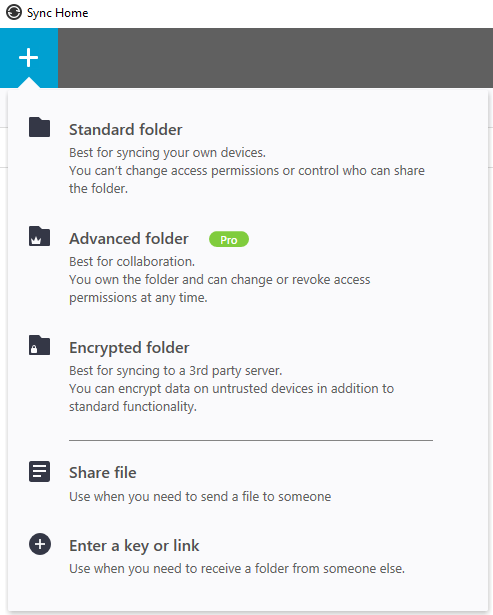

[back](../resilio-sync-guide#read-only-key-for-my-test-share)

# Sync folder with key using Resilio Sync


## Read only key for my test share

This is permanent key for connecting my test share.
I DO NOT recommend this method.

You should always use temporaty link for sharing. Temporary links will expire.
It is safer.

Read only key:
```
B66VIKY3A34K6UE3L3W44ZGRBWEM3MSBK
```

## Use key to create shared folder

 1. Click '+' symbol top left of Resilio Sync app
 2. Next select 'Enter a key or link' from the list

    

 3. Enter the key
 4. Create/select folder where you want to plase content of shared foled


